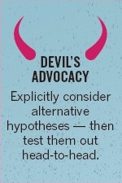
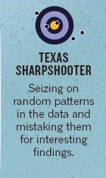
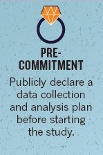
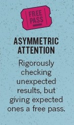
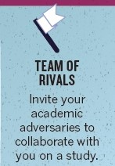
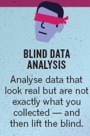

```{r setup, include=FALSE}
knitr::opts_chunk$set(echo = TRUE)
```

## Cognitive Fallacy - Number 1

### The Fallacy - Hypothesis Myopia

```{r echo=FALSE, fig.align="center", out.width="25%"}
knitr::include_graphics("Reproducibility - 1.jpeg")
```

-   Hypothesis Myopia is where researchers fixate on one hypothesis, and seek to gather evidence for that particular hypothesis, rather than exploring other hypotheses/entertaining other possibilities, questioning their hypothesis' validity, or gathering evidence that would go against their hypothesis.

-   Example: A group of researchers set out to show how a poor diet increases the likelihood of developing cancer. They run a study in a particular town and find evidence supporting their claim. However, they ignore that some individuals with cancer live in the same part of town, which happens to be next to an oil refinery. In doing so, they ignore the influence that this proximity may have on developing cancer and simply find evidence supporting their hypothesis.

### The Solution - Devil's Advocacy

```{r echo=FALSE, fig.align="center", out.width="25%"}

```

-   Devil's Advocacy is where researchers consider alternative hypotheses and conduct experiments to help determine which of the hypotheses better explains the outcome. This is also known as strong inference.

-   Example: The same researchers above decide to parse out their experiment into two competing hypotheses: poor diet habits are responsible for a higher likelihood of developing cancer and proximity to an oil refinery is responsible for an increased likelihood of developing cancer. After conducting their experiments, they find that proximity to an oil refinery is the better explanation for the increased likelihood in cancer.

## Cognitive Fallacy - Number 2

### The Fallacy - Texas Sharpshooter

```{r echo=FALSE, fig.align="center", out.width="25%"}

```

-   Texas Sharpshooter is where researchers look at the data they collected and focus on random patterns and mistake them for something significant. This can occur when a researcher looks at their data and get encouraged by the random patterns and focus on reporting/investigating them. This is closely tied with p-hacking and leads to biased investigations and false success relationships.

-   Example: A researcher is interested in showing that cigarettes lead to an increased life expectancy. They conduct an experiment and find encouraging preliminary evidence that shows that cigarettes lead to decreased rates of obesity. They then decide to investigate this relationship and do not report on their initial hypothesis.

### The Solution - Pre-Commitment

```{r echo=FALSE, fig.align="center", out.width="25%"}

```

-   Pre-Commitment is where researchers public announce and set out to research a particular hypothesis and set a data collection and analysis plan in place prior to conducting the study. This ensures that the research is mostly unbiased and that researchers do not fish for "successful" results or report only favorable findings. This is also known as open research or transparency.

-   Example: A researcher is interested in the relationship between asthma and lung cancer. They design their study and publicly announce their study methods, data, and analytic approach. Following their study, they publish their results in accordance with their plan and show that they found no evidence supporting the relationship between asthma and lung cancer.

## Cognitive Fallacy - Number 3

### The Fallacy - Asymmetric Attention

```{r echo=FALSE, fig.align="center", out.width="25%"}

```

-   Asymmetric Attention is where researchers do not pay as much attention to expected findings as unexpected findings. This means that a researcher will scrutinize their unexpected relationships, but accept their expected findings as true without much scrutiny. This also means that some expected results will get reported improperly because they did not get as much attention as they should have. This is also known as disconformation bias.

-   Example: A researcher investigating obesity and the factors associated with its development. They find four expected results and one unexpected significant results. They spend time explaining the errors in their experiment that could explain their unexpected finding, but do not do the same for the 4 expected results. They publish their findings and then when checked later on, someone finds that one of the expected significant findings was not actually true and the researcher made a non-significant result significant.

### The Solution - Team of Rivals

```{r echo=FALSE, fig.align="center", out.width="25%"}

```

-   Team of Rivals is where researchers invite other researchers with differing opinions and theories to work on their study with them. This allows for a more balanced and scrutinized study to be performed compared to if only people with the same theories conducted a study with one another. This is also called a proponent-skeptic approach.

-   Example: A researcher interested in showing that humans have contributed to climate change invites another researcher who is skeptical of humans involvement in climate change to work on their study. They work on the study with one another and share competing theories for climate change. In doing so, they found common ground with one another and generated new hypotheses to be tested in the future.

## Cognitive Fallacy - Number 4

### The Fallacy - Just-So Storytelling

```{r echo=FALSE, fig.align="center", out.width="25%"}
knitr::include_graphics("Reproducibility - 7.jpeg")
```

-   Just-so Storytelling is where researchers create stories to explain their studies findings. This is done following data analysis and may indeed be true, but it also may not because this story was not the purpose of their study.

-   Example: An ornithologist conducts a study and finds that a specific bird species has an increased occurrence rate on telephone wires above hedgerows. They then concoct a story to explain that the bird must use the telephone wires as a vantage point while they hunt in hedgerows. This is done in an attempt to justify their findings.

### The Solution - Blind Data Analysis

```{r echo=FALSE, fig.align="center", out.width="25%"}

```

-   Blind Data Analysis is where researchers analyze their data by including a hidden offset, alternative data sets, random noise, or moving participants between study groups. This essentially masks the true result and prevents researchers from being biased by stories since the researcher does not know their true outcome. They may even write up their results and then un-blind their study by conducting the analysis on the true data set.

-   Example: A researcher interested in the relationship between environmental factors and the development of glaucoma conducts their study and gathers data. They then generate a completely random data set with the same number of variables and outcomes and performs their analyses. They even write their results section. They then use the original data set and conduct their analyses and modify the findings in the results section.

[@Reference]
